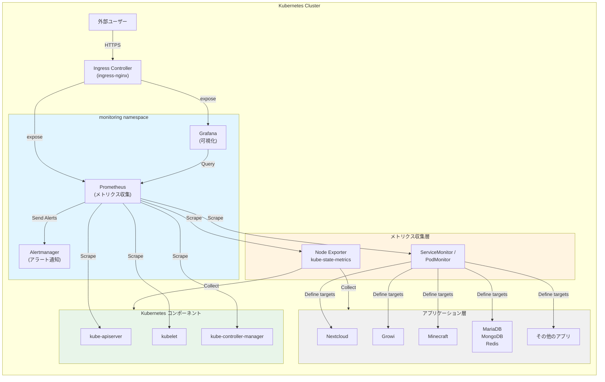

# PrometheusとGrafana導入設計書

## 1. 概要

### 1.1 目的
本設計書は、既存のKubernetesクラスタにPrometheusとGrafanaを導入し、クラスタ全体の監視・可観測性を実現することを目的とする。

### 1.2 スコープ
- Prometheus Operatorによるメトリクス収集基盤の構築
- Grafanaによる可視化ダッシュボードの提供
- 主要コンポーネントのメトリクス収集設定
- アラート設定の基盤構築

### 1.3 進捗状況

**現在のステータス: マニフェスト作成完了、テスト待ち**

| フェーズ | ステータス | 完了日 | 備考 |
|---------|----------|--------|------|
| 設計書作成 | ✅ 完了 | 2025-11-05 | 本ドキュメント |
| issue作成 | ✅ 完了 | 2025-11-05 | [#110](https://github.com/ITK13201/k8s/issues/110) |
| マニフェスト作成 | ✅ 完了 | 2025-11-05 | 16ファイル、1255行 |
| CLAUDE.md更新 | ✅ 完了 | 2025-11-05 | Git workflow、Kustomizeパターン追加 |
| Minikube環境テスト | ⏳ 未実施 | - | セクション10参照 |
| 本番環境デプロイ | ⏳ 未実施 | - | セクション11参照 |
| Discord通知設定 | ⏳ 未実施 | - | セクション8.2.1参照 |

**作成済みファイル一覧:**
- `manifests/namespaces/monitoring.yaml` - monitoring namespace
- `manifests/pv/prometheus-server.yaml` - Prometheus PV (10Gi)
- `manifests/pv/prometheus-alertmanager.yaml` - Alertmanager PV (5Gi)
- `manifests/pv/grafana.yaml` - Grafana PV (5Gi)
- `manifests/monitoring/kustomization.yaml` - Kustomize helmCharts設定
- `manifests/monitoring/values.yaml` - kube-prometheus-stack設定
- `manifests/monitoring/prometheus-pvc.yaml` - Prometheus PVC
- `manifests/monitoring/alertmanager-pvc.yaml` - Alertmanager PVC
- `manifests/monitoring/grafana-pvc.yaml` - Grafana PVC
- `manifests/ingress/prometheus.yaml` - Prometheus Ingress
- `manifests/ingress/grafana.yaml` - Grafana Ingress
- 既存kustomization.yamlの更新（namespaces, pv, ingress）

**Gitブランチ:**
- ブランチ名: `feature/add-monitoring`
- コミット数: 3
- 最新コミット: `#110 docs: update design doc with Kustomize helmCharts pattern`

**次のステップ:**
1. Minikube環境でのテスト実施（セクション10）
2. テスト完了後、PRを作成してmainブランチにマージ
3. 本番環境へのデプロイ（ArgoCD自動同期）
4. 動作確認と検証チェックリストの実施

## 2. アーキテクチャ設計

### 2.1 全体構成



### 2.2 コンポーネント概要

| コンポーネント | 役割 | 備考 |
|-------------|------|------|
| Prometheus Operator | Prometheusインスタンスの管理 | CRDベースの宣言的管理 |
| Prometheus | メトリクスの収集・保存 | 時系列データベース |
| Grafana | メトリクスの可視化 | ダッシュボード提供 |
| Alertmanager | アラート通知 | 初期導入では基本設定のみ |
| Node Exporter | ノードメトリクスの収集 | CPU、メモリ、ディスクなど |
| kube-state-metrics | Kubernetesリソースの状態収集 | Pod、Deployment状態など |

## 3. デプロイメント設計

### 3.1 使用するHelmチャート

**kube-prometheus-stack**を使用する。
- Chart Repository: https://prometheus-community.github.io/helm-charts
- Chart Name: kube-prometheus-stack
- Chart Version: 69.2.1
- 理由: Prometheus Operator、Prometheus、Grafana、Alertmanager、各種Exporterが統合されており、管理が容易

### 3.2 デプロイ方法

**Kustomize helmChartsフィールド**を使用してデプロイする。

このリポジトリの標準パターンに従い、Helmチャートは直接実行せず、Kustomizeのみを使用してマニフェスト管理を行う。

**選定理由:**
- ✅ 既存パターン（minecraft, nextcloud, growi等）との一貫性
- ✅ GitOps-friendly: ArgoCD ApplicationSetと統合
- ✅ Kustomize必須要件を満たす
- ✅ リポジトリ内で統一された管理方法

**kustomization.yaml例:**
```yaml
apiVersion: kustomize.config.k8s.io/v1beta1
kind: Kustomization
namespace: monitoring
helmCharts:
- name: kube-prometheus-stack
  repo: https://prometheus-community.github.io/helm-charts
  version: 69.2.1
  releaseName: kube-prometheus-stack
  namespace: monitoring
  valuesFile: values.yaml
  valuesMerge: override
  includeCRDs: true
resources:
- prometheus-pvc.yaml
- alertmanager-pvc.yaml
- grafana-pvc.yaml
```

**注意事項:**
- ArgoCD側で`--enable-helm`フラグが有効になっている必要がある
- ローカルでの`kustomize build`はhelmChartsフィールドをサポートしていない
- ArgoCD経由でのデプロイが前提

### 3.3 ディレクトリ構造

```
manifests/
├── namespaces/
│   ├── kustomization.yaml         # monitoring.yamlを追加
│   └── monitoring.yaml             # 新規作成
├── pv/
│   ├── kustomization.yaml         # prometheus-*.yaml, grafana-*.yamlを追加
│   ├── prometheus-server.yaml     # 新規作成
│   ├── prometheus-alertmanager.yaml # 新規作成
│   └── grafana.yaml               # 新規作成
├── ingress/
│   ├── kustomization.yaml         # prometheus.yaml, grafana.yamlを追加
│   ├── prometheus.yaml            # 新規作成
│   └── grafana.yaml               # 新規作成
└── monitoring/
    ├── kustomization.yaml         # 新規作成
    ├── values.yaml                # 新規作成（kube-prometheus-stack設定）
    ├── prometheus-pvc.yaml        # 新規作成
    ├── alertmanager-pvc.yaml      # 新規作成
    └── grafana-pvc.yaml           # 新規作成
```

### 3.4 ネームスペース

- Namespace名: `monitoring`
- ラベル: `name: monitoring`

## 4. ストレージ設計

### 4.1 PersistentVolume要件

| コンポーネント | 容量 | アクセスモード | 用途 |
|-------------|------|-------------|------|
| Prometheus | 50Gi | ReadWriteOnce | メトリクスデータの永続化 |
| Alertmanager | 10Gi | ReadWriteOnce | アラート状態の永続化 |
| Grafana | 10Gi | ReadWriteOnce | ダッシュボード設定の永続化 |

### 4.2 ストレージクラス

Minikube環境: `standard` (hostPath)
本番環境: 環境に応じて適切なStorageClassを指定

### 4.3 保持期間

- Prometheusメトリクス保持期間: 15日 (デフォルト)
- 必要に応じて後から調整可能

## 5. メトリクス収集設計

### 5.1 自動収集対象

kube-prometheus-stackがデフォルトで収集するメトリクス:

1. **Kubernetesコンポーネント**
   - kube-apiserver
   - kube-controller-manager
   - kube-scheduler
   - kubelet
   - kube-proxy

2. **ノードメトリクス**
   - CPU使用率
   - メモリ使用率
   - ディスクI/O
   - ネットワークトラフィック

3. **Kubernetesリソース状態**
   - Pod状態
   - Deployment状態
   - Service状態
   - Node状態

### 5.2 追加収集対象（将来的に実装）

以下のアプリケーションに対してServiceMonitorを追加予定:

1. **インフラストラクチャ**
   - ingress-nginx: `/metrics` エンドポイント
   - cert-manager: `/metrics` エンドポイント
   - ArgoCD: `/metrics` エンドポイント

2. **データベース**
   - MariaDB (mysqld-exporter経由)
   - MongoDB (mongodb-exporter経由)
   - Redis (redis-exporter経由)
   - Elasticsearch (elasticsearch-exporter経由)

3. **アプリケーション**
   - Nextcloud: アプリケーションメトリクス
   - Growi: アプリケーションメトリクス

### 5.3 ServiceMonitor/PodMonitorの配置

各アプリケーションのmanifestsディレクトリ内に配置:
- `manifests/<app-name>/servicemonitor.yaml`
- `manifests/<app-name>/kustomization.yaml`に追加

## 6. Grafana設定

### 6.1 データソース

- Prometheusを自動的にデータソースとして登録
- URL: `http://kube-prometheus-stack-prometheus.monitoring.svc:9090`

### 6.2 初期ダッシュボード

kube-prometheus-stackに含まれるダッシュボード:
- Kubernetes / Compute Resources / Cluster
- Kubernetes / Compute Resources / Namespace
- Kubernetes / Compute Resources / Node
- Kubernetes / Compute Resources / Pod
- Node Exporter / Nodes
- Prometheus

### 6.3 認証設定

- 初期管理者アカウント: `admin`
- パスワード: Secretで管理
- 認証方式: Basic認証（初期）

### 6.4 Ingress設定

- ホスト名: `grafana.<domain>`
- TLS: cert-manager経由でLet's Encrypt証明書を取得
- 認証: Ingress-nginx basic-auth（オプション）

## 7. Prometheus設定

### 7.1 スクレイプ間隔

- デフォルト: 30秒
- 調整可能な設定項目として`values.yaml`で定義

### 7.2 Ingress設定

- ホスト名: `prometheus.<domain>`
- TLS: cert-manager経由でLet's Encrypt証明書を取得
- アクセス制限: 必須（認証・IP制限）

### 7.3 RBAC

Prometheus Operatorが必要なRBACは自動的に作成される:
- ServiceAccount
- ClusterRole
- ClusterRoleBinding

## 8. アラート設計

### 8.1 初期アラートルール

kube-prometheus-stackのデフォルトアラートルールを使用:
- ノードダウン検知
- Pod障害検知
- 高CPU使用率
- 高メモリ使用率
- ディスク容量不足

### 8.2 Alertmanager設定

#### 8.2.1 Discord通知の設定

AlertmanagerからDiscordへアラートを通知することが可能です。Discord Webhookを使用します。

**設定手順:**

1. **Discord Webhook URLの作成**
   - Discordのサーバー設定 → 連携サービス → ウェブフック
   - 新しいウェブフックを作成し、URLをコピー

2. **Secretの作成**
   ```bash
   # credentials/monitoring/alertmanager.env
   DISCORD_WEBHOOK_URL=https://discord.com/api/webhooks/xxxxx/yyyyy
   ```

3. **Alertmanager設定（values.yamlに追加）**
   ```yaml
   alertmanager:
     config:
       global:
         resolve_timeout: 5m
       route:
         group_by: ['alertname', 'cluster', 'service']
         group_wait: 10s
         group_interval: 10s
         repeat_interval: 12h
         receiver: 'discord'
       receivers:
       - name: 'discord'
         webhook_configs:
         - url: '${DISCORD_WEBHOOK_URL}'
           send_resolved: true
   ```

4. **ConfigMapとSecretの連携**
   - AlertmanagerのConfigMapにWebhook URL環境変数を設定
   - Secretから環境変数を注入

#### 8.2.2 通知フォーマット

Discordに送信されるアラートには以下の情報が含まれます:
- アラート名
- 重要度（severity）
- 発生時刻
- 詳細メッセージ
- ソース（Pod、Node等）

#### 8.2.3 段階的な導入

1. **Phase 1（初期）**: ログ出力のみ
2. **Phase 2**: Discord通知を追加（重要度: critical のみ）
3. **Phase 3**: 全ての重要度のアラートをDiscordに通知
4. **Phase 4**: 通知先を重要度やチームごとに分割

### 8.3 カスタムアラートルールの追加

将来的に以下を追加予定:
- アプリケーション固有のアラート
- ビジネスメトリクスに基づくアラート
- カスタム閾値の設定

## 9. セキュリティ考慮事項

### 9.1 アクセス制御

1. **Grafanaアクセス**
   - Basic認証必須
   - Ingressレベルでの制限推奨

2. **Prometheusアクセス**
   - Ingress経由のアクセスには認証必須
   - 内部からのアクセスはServiceMonitor経由のみ

3. **Secretの管理**
   - Grafana管理者パスワードはSecretで管理
   - `credentials/monitoring/`ディレクトリに`.env`ファイルを配置
   - `./bin/create_secrets.sh`で生成

### 9.2 NetworkPolicy

monitoring namespaceに対するNetworkPolicyを設定:
- Prometheus: 各namespaceからのメトリクススクレイプを許可
- Grafana: Ingressからのアクセスのみ許可

## 10. テスト・検証手順（Minikube環境）

本番環境へのデプロイ前に、Minikube環境で十分なテストを実施します。

### 10.1 Minikube環境のセットアップ

1. **Minikubeクラスタの起動**
   ```bash
   minikube start --cpus=4 --memory=8192
   ```

2. **トンネルの作成（別ターミナル）**
   ```bash
   minikube tunnel
   ```
   ※ LoadBalancerタイプのServiceにアクセスするために必要

### 10.2 テスト用マニフェストの準備

本番環境と同じ構成でテストするため、以下のブランチ戦略を使用：

1. **テスト用ブランチの作成**
   ```bash
   git checkout -b feature/add-monitoring
   ```

2. **テスト用の設定調整**
   - ストレージサイズを小さく設定（Prometheus: 10Gi、Grafana: 5Gi等）
   - リソース制限を緩和（CPUとメモリ）
   - Ingress設定をMinikube用に調整（証明書はself-signedでもOK）

### 10.3 段階的なデプロイメント

#### Phase 1: 基本コンポーネントのデプロイ

1. **ネームスペース作成**
   ```bash
   kubectl apply -f manifests/namespaces/monitoring.yaml
   ```

2. **PersistentVolume作成**
   ```bash
   kubectl apply -f manifests/pv/prometheus-server.yaml
   kubectl apply -f manifests/pv/prometheus-alertmanager.yaml
   kubectl apply -f manifests/pv/grafana.yaml
   ```

3. **Secret作成**
   ```bash
   # credentials/monitoring/grafana.env を作成
   echo "GF_SECURITY_ADMIN_PASSWORD=test-password" > credentials/monitoring/grafana.env
   ./bin/create_secrets.sh
   kubectl apply -f secrets/monitoring/grafana.yaml
   ```

4. **監視スタックのデプロイ**
   ```bash
   kubectl apply -k manifests/monitoring/
   ```

5. **Pod起動確認**
   ```bash
   kubectl get pods -n monitoring -w
   ```
   ※ 全てのPodが`Running`になるまで待機（5-10分程度）

#### Phase 2: 動作確認

1. **Serviceの確認**
   ```bash
   kubectl get svc -n monitoring
   ```

2. **Prometheusへのアクセス**
   ```bash
   # Port-forward経由でアクセス
   kubectl port-forward -n monitoring svc/kube-prometheus-stack-prometheus 9090:9090
   ```
   - ブラウザで http://localhost:9090 にアクセス
   - Status → Targets でメトリクス収集対象を確認
   - 全てのターゲットが`UP`になっていることを確認

3. **Grafanaへのアクセス**
   ```bash
   kubectl port-forward -n monitoring svc/kube-prometheus-stack-grafana 3000:80
   ```
   - ブラウザで http://localhost:3000 にアクセス
   - admin / test-password でログイン
   - デフォルトダッシュボードが表示されることを確認

#### Phase 3: メトリクス収集の確認

1. **Prometheusクエリでメトリクスを確認**
   ```promql
   # ノードのCPU使用率
   node_cpu_seconds_total

   # Pod数
   kube_pod_info

   # メモリ使用量
   node_memory_MemAvailable_bytes
   ```

2. **Grafanaダッシュボードで確認**
   - "Kubernetes / Compute Resources / Cluster" を開く
   - メトリクスがグラフに表示されることを確認
   - 時間範囲を変更して正しくデータが表示されるか確認

#### Phase 4: アラート機能のテスト

1. **アラートルールの確認**
   ```bash
   kubectl port-forward -n monitoring svc/kube-prometheus-stack-prometheus 9090:9090
   ```
   - Prometheus UI → Alerts
   - デフォルトアラートルールが読み込まれていることを確認

2. **テストアラートの発火**

   意図的にリソース不足を起こしてアラートをテスト：
   ```bash
   # テスト用の高負荷Podをデプロイ
   kubectl run stress-test --image=polinux/stress --restart=Never -- stress --cpu 2 --timeout 60s
   ```

   約1-2分後、PrometheusのAlertsページでアラートが発火することを確認

3. **Alertmanagerの確認**
   ```bash
   kubectl port-forward -n monitoring svc/kube-prometheus-stack-alertmanager 9093:9093
   ```
   - ブラウザで http://localhost:9093 にアクセス
   - 発火したアラートが表示されることを確認

#### Phase 5: Discord通知のテスト（オプション）

Discord通知を設定する場合：

1. **テスト用Discord Webhook設定**
   ```bash
   # credentials/monitoring/alertmanager.env に追加
   echo "DISCORD_WEBHOOK_URL=https://discord.com/api/webhooks/xxxxx/yyyyy" >> credentials/monitoring/alertmanager.env
   ```

2. **Alertmanager設定を更新**
   values.yamlにDiscord Webhook設定を追加後、再デプロイ

3. **テスト通知の送信**
   テストアラートを発火させて、Discordに通知が届くことを確認

### 10.4 検証チェックリスト

以下の項目を全て確認してから本番環境へのデプロイを進めます：

- [ ] 全てのPodが正常に起動している
- [ ] Prometheusが全てのターゲットからメトリクスを収集している
- [ ] Grafanaにログインできる
- [ ] Grafanaダッシュボードでメトリクスが表示される
- [ ] Prometheusでクエリが実行できる
- [ ] アラートルールが読み込まれている
- [ ] テストアラートが正しく発火する
- [ ] Alertmanagerがアラートを受信している
- [ ] （オプション）Discord通知が正しく送信される
- [ ] PersistentVolumeが正しくマウントされている
- [ ] リソース使用量が許容範囲内である

### 10.5 問題発生時のトラブルシューティング

1. **Podが起動しない場合**
   ```bash
   kubectl describe pod <pod-name> -n monitoring
   kubectl logs <pod-name> -n monitoring
   ```

2. **メトリクスが収集されない場合**
   - ServiceMonitor/PodMonitorの設定を確認
   - ネットワークポリシーを確認
   - Prometheusのログを確認

3. **Grafanaにログインできない場合**
   - Secretが正しく作成されているか確認
   - Podのログを確認

4. **リソース不足の場合**
   - Minikubeのメモリ・CPU割り当てを増やす
   - values.yamlでリソース制限を緩和

### 10.6 テスト完了後のクリーンアップ

テストが完了したら、以下の手順でクリーンアップ：

```bash
# 監視スタックの削除
kubectl delete -k manifests/monitoring/

# ネームスペースの削除
kubectl delete namespace monitoring

# Minikubeクラスタの削除（必要に応じて）
minikube delete
```

テストで問題がなければ、本番環境へのデプロイを進めます。

## 11. デプロイメント手順（本番環境）

### 11.1 前提条件

- ArgoCD、ingress-nginx、cert-managerが既にデプロイ済み
- PersistentVolumeが作成可能な環境
- Minikube環境でのテストが完了していること

### 11.2 初期構築手順

1. **GitHub issueの作成**
   ```bash
   gh issue create --title "PrometheusとGrafanaの監視スタックを導入" \
     --body "監視スタックの導入..." \
     --label enhancement
   # issue番号（例: #110）をメモする
   ```

2. **ネームスペース作成**
   ```bash
   kubectl apply -f manifests/namespaces/monitoring.yaml
   ```

3. **PersistentVolume作成**
   ```bash
   kubectl apply -f manifests/pv/prometheus-server.yaml
   kubectl apply -f manifests/pv/prometheus-alertmanager.yaml
   kubectl apply -f manifests/pv/grafana.yaml
   ```

4. **Secret作成**
   ```bash
   # credentials/monitoring/grafana.env を作成
   # GF_SECURITY_ADMIN_PASSWORD=<パスワード>
   ./bin/create_secrets.sh
   ```

5. **マニフェスト適用（ArgoCD経由）**
   ```bash
   git add manifests/monitoring/
   git commit -m "#110 feat: add Prometheus and Grafana monitoring stack

   PrometheusとGrafanaの監視スタックを導入

   - kube-prometheus-stack (v69.2.1) をKustomize helmChartsで管理
   - Prometheus、Grafana、Alertmanagerの設定
   - PersistentVolume/PVCの作成
   - Ingress設定

   🤖 Generated with [Claude Code](https://claude.com/claude-code)

   Co-Authored-By: Claude <noreply@anthropic.com>"

   git push origin feature/add-monitoring
   # PRを作成してmainにマージ
   # ArgoCDが自動的に同期
   ```

6. **手動適用する場合**
   ```bash
   kubectl apply -k manifests/monitoring/
   ```

**コミットメッセージ規約:**
- 先頭にissue番号を含める: `#<issue-number> <type>: <description>`
- 種別: `feat`, `fix`, `docs`, `refactor`, `test` など
- 詳細な変更内容を本文に記載

### 11.3 デプロイメント後の確認

1. **Pod起動確認**
   ```bash
   kubectl get pods -n monitoring
   ```

2. **Service確認**
   ```bash
   kubectl get svc -n monitoring
   ```

3. **Ingress確認**
   ```bash
   kubectl get ingress -n monitoring
   ```

4. **Grafanaアクセス確認**
   - ブラウザで `https://grafana.<domain>` にアクセス
   - admin/パスワードでログイン

5. **Prometheusアクセス確認**
   - ブラウザで `https://prometheus.<domain>` にアクセス
   - メトリクスが収集されていることを確認

## 12. 運用

### 12.1 メトリクスの確認

- Grafanaダッシュボードで可視化
- Prometheusクエリインターフェースで直接確認

### 12.2 バックアップ

- Grafanaダッシュボード: JSON形式でエクスポート
- Prometheus設定: GitOpsで管理されているため不要
- メトリクスデータ: PersistentVolumeのバックアップが必要な場合は別途設定

### 12.3 スケーリング

必要に応じて以下を調整:
- Prometheusのレプリカ数
- メトリクス保持期間
- ストレージ容量

### 12.4 アップグレード

- Renovateによる自動バージョン更新
- マイナー/パッチバージョンは自動マージ設定済み
- メジャーバージョンアップグレード時は動作確認が必要

## 13. トラブルシューティング

### 13.1 よくある問題

1. **Podが起動しない**
   - PersistentVolumeが正しく作成されているか確認
   - リソース不足の可能性を確認

2. **メトリクスが収集されない**
   - ServiceMonitor/PodMonitorの設定を確認
   - ネットワークポリシーを確認
   - ターゲットのエンドポイントが存在するか確認

3. **Grafanaにログインできない**
   - Secretが正しく作成されているか確認
   - Podのログを確認

### 13.2 ログ確認

```bash
# Prometheusログ
kubectl logs -n monitoring -l app.kubernetes.io/name=prometheus

# Grafanaログ
kubectl logs -n monitoring -l app.kubernetes.io/name=grafana

# Operatorログ
kubectl logs -n monitoring -l app.kubernetes.io/name=prometheus-operator
```

## 14. 参考資料

- [kube-prometheus-stack公式ドキュメント](https://github.com/prometheus-community/helm-charts/tree/main/charts/kube-prometheus-stack)
- [Prometheus公式ドキュメント](https://prometheus.io/docs/)
- [Grafana公式ドキュメント](https://grafana.com/docs/)
- [Prometheus Operator](https://prometheus-operator.dev/)

## 15. 今後の拡張予定

1. **Phase 2: アプリケーション監視**
   - 各アプリケーションへのServiceMonitor追加
   - カスタムダッシュボード作成

2. **Phase 3: アラート拡充**
   - Discord通知設定の本格導入
   - カスタムアラートルール追加

3. **Phase 4: ログ統合**
   - Loki導入によるログ集約
   - Grafanaでのログ可視化

4. **Phase 5: トレーシング**
   - Jaeger/Tempo導入
   - 分散トレーシング実装
